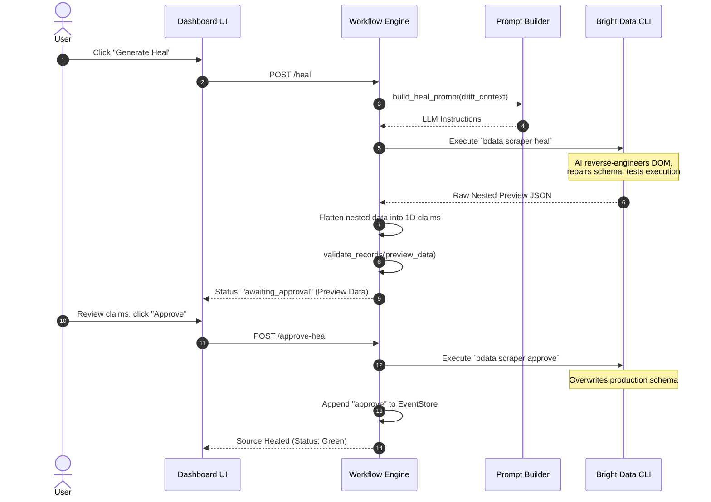

# Architecture

## Overview
Zeal is an automated data fidelity platform that prevents silent website changes from polluting downstream databases. It orchestrates Bright Data Scraper Studio extractions, validates schemas and detects drift on live data, and provides a human-in-the-loop self-healing mechanism to automatically repair broken scrapers using AI without dropping data quality.

## System Architecture

Zeal follows a clean, decoupled architecture. The React frontend interacts with a FastAPI backend that acts as the command center. The backend orchestrates external extractions via Bright Data, evaluates data fidelity locally, and stores immutable state in an event-sourced SQLite database.

### 1. Structural Architecture

```mermaid
graph TB
    subgraph Client
        Dashboard[React Dashboard UI\n(Vite, TailwindCSS)]
    end

    subgraph Zeal [FastAPI Application]
        API[API Router\nrouters/api.py]
        
        subgraph Service Layer
            Orchestrator[Workflow Engine\nworkflows.py]
            Validator[Schema Validation\nvalidation.py]
            DriftEngine[Drift Detection\ndrift.py]
            HealthScorer[Health Scoring\nscoring.py]
            HealPrompt[Prompt Builder\nprompt_builder.py]
        end
        
        EventStore[(SQLite Event Store\nstorage.py)]
    end

    subgraph External Infrastructure
        BDCLI[Bright Data Scraper Studio CLI]
        BDAPI[Bright Data API / Workers]
        TargetWeb[Target Websites]
        LLM[Anthropic LLMs\n(via Bright Data)]
    end

    %% Client to Backend
    Dashboard -- "HTTP REST" --> API
    API --> Orchestrator
    
    %% Internal orchestration
    Orchestrator --> Validator
    Orchestrator --> DriftEngine
    Orchestrator --> HealthScorer
    Orchestrator --> HealPrompt
    Orchestrator -- "Append Events" --> EventStore
    
    %% Backend to Infrastructure
    Orchestrator -- "Execute sync/heal" --> BDCLI
    BDCLI -.-> BDAPI
    BDAPI -- "Extract Data" --> TargetWeb
    BDAPI -- "Generate/Fix Schema" --> LLM

    classDef core fill:#0f172a,stroke:#38bdf8,stroke-width:2px,color:#fff;
    classDef infra fill:#1e293b,stroke:#94a3b8,stroke-width:2px,color:#fff;
    class Orchestrator,Validator,DriftEngine,HealthScorer,HealPrompt core;
    class EventStore,BDCLI,BDAPI,TargetWeb,LLM infra;
```

### 2. The Self-Healing Sequence

The following sequence diagram illustrates the exact flow of data and control when structural drift is detected and a human operator initiates a self-healing cycle.



## Component Responsibilities

| Component | File Path | What It Owns | What It Does NOT Own |
|---|---|---|---|
| **API Router** | `backend/app/routers/api.py` | FastAPI HTTP endpoints, route handling, request validation | Business logic, direct DB calls, Bright Data orchestration |
| **Validation** | `backend/app/services/validation.py` | Schema completeness checks, computing null rates for partial data | Drift calculation, overall health scoring |
| **Drift Detection** | `backend/app/services/drift.py` | Identifying structural drift (missing fields) and semantic drift (content changes) | Schema definition, event storage |
| **Scoring** | `backend/app/services/scoring.py` | Computing the final 0-100 health score based on drift and null rates | Data extraction, validation rules |
| **Prompt Builder** | `backend/app/services/prompt_builder.py` | Generating context-aware prompt payloads to instruct the AI on how to heal broken scrapers | Executing the actual heal request |
| **Workflows** | `backend/app/services/workflows.py` | Orchestrating the scraping lifecycle (run, heal, approve), gluing services together | Low-level data storage, HTTP transport |
| **Storage** | `backend/app/services/storage.py` | Abstracting SQLite interactions, appending immutable events to the event store | Interpreting the meaning of the events |

## Data Flow: A Single Source's Lifecycle

When a user initiates a healthy run, the data flows through the following exact lifecycle:
1. **Initiation**: The React frontend calls the `POST /sources/{source_id}/run` endpoint.
2. **Orchestration**: `routers/api.py` hands the request to `workflows.py:GroundTruthService.run_source()`.
3. **Extraction**: `run_source()` calls `BrightDataClient.run_scraper()` to execute a synchronous CLI command fetching real-time live data.
4. **Validation**: The raw records are passed to `validate_records()` which checks for structural integrity against `sources.yml`.
5. **Drift Analysis**: `detect_drift()` compares the current validated records against the previous successful run (fetched via `store.latest_records()`).
6. **Scoring**: `grounding_health_score()` aggregates the validation and drift results into a final 0-100 confidence score.
7. **Storage**: The complete result payload is passed to `EventStore.append()` which immutably logs it into SQLite.

## The Self-Healing Loop

The healing loop provides resilience without sacrificing safety:
1. `heal_source()` detects drift contexts and uses `prompt_builder.py` to generate an LLM instruction.
2. For real sources (e.g., `anthropic_pricing`), this prompt is sent via `BrightDataClient.heal_scraper()`, which generates and executes a repaired schema on Bright Data's end. For the `canary_vendor` source, this bypasses the real network call and uses a local fixture swap to guarantee a fast, deterministic demo.
3. **The Flattening Problem**: The preview payload returned by Bright Data is often deeply nested. We explicitly flatten the output into 1D dictionaries so our granular Trust Ledger claims can hash and track individual fields (e.g., `input_price` vs. an entire nested `pricing` object).
4. **Re-Validation**: The flattened preview is re-validated via `validate_records()`.
5. **The Human Gate**: The preview is stored in an `awaiting_approval` state. We intentionally require a human to click **Approve** (calling `approve_heal()`) before permanently deploying the scraper updates to Bright Data. This ensures no unverified, hallucinated logic is silently pushed to production.

## Design Decisions & Trade-offs

- **Canary Vendor Fixture**: `canary_vendor` is implemented as a local fixture rather than a real Bright Data scraper. This guarantees a deterministic, consistently failing target we can use to robustly demo the self-healing workflow without relying on external websites breaking on command.
- **Validation Strictness**: Validation only hard-fails (structural drift) when a required field is missing from *all* records. If a field is merely missing from *some* records, it is treated as a null rate. This prevents a single edge case from bringing down the entire pipeline, while still penalizing the confidence score and visibly flagging the claims as "at-risk".
- **Weight Calculation**: Our Mesh Overview weights influence the aggregate global score but do not cap an individual source's score ceiling. This allows individual critical sources to remain highly visible even if their relative weight is small.
- **Demo Mode Isolation**: `demo_mode` bypasses real network calls entirely, returning static fixture data. This ensures demo flows are pristine, lightning-fast, and entirely isolated from live production configuration.

## Known Limitations

- **AI Non-Determinism**: Scraper healing relies on LLMs, which are non-deterministic. A heal prompt may fail to generate a working schema on the first attempt.
- **Concurrent Job Cap**: Bright Data Scraper Studio enforces a hard limit on concurrent synchronous jobs. Bulk running multiple sources simultaneously will trigger rate limits.
- **Semantic Drift Measurement**: Currently, semantic drift relies on basic text distance (Levenshtein/Jaccard similarity). In a production scale-up, this should be replaced with vector embeddings for deeper semantic understanding.
