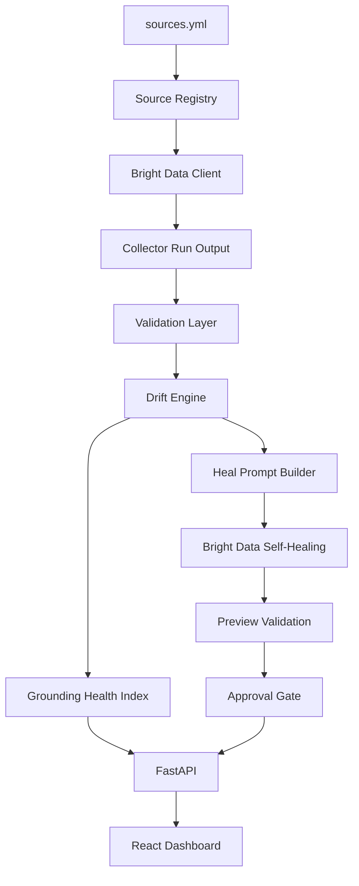

# Architecture

## Responsibilities

- Source registry defines public URLs and expected fields.
- Bright Data client owns CLI calls and normalizes command envelopes.
- Validation catches empty, partial, and schema-invalid output.
- Drift detection compares current normalized content with prior snapshots.
- Heal workflow builds a prompt, triggers `scraper heal`, validates preview output, and blocks approval on invalid previews.
- API and dashboard expose runs, drift, health, and healing events.

